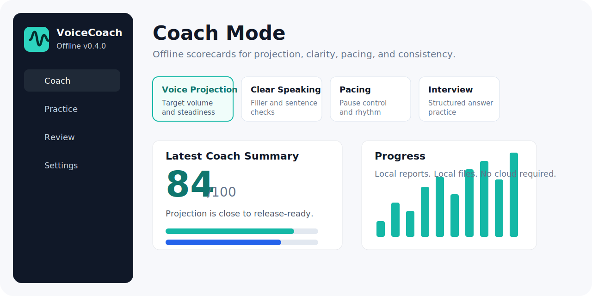

# VoiceCoach Offline



VoiceCoach Offline is an offline-first Windows desktop app for practicing stronger, clearer speaking. It calibrates your microphone, records audio or camera practice sessions, gives live low-volume feedback, captures built-in speech transcripts when available, and saves local review reports.

Current version: `0.7.0`

`0.7.0` is the Simplified Practice UI release before the planned `1.0.0` stabilization release.

## Highlights

- Fully offline by default: no cloud service, account, or internet connection required.
- Calibrated live volume meter with low-volume warnings.
- Audio-only or camera-plus-microphone local recording with `recording.webm` session files.
- Camera selector, resolution, frame-rate, and mirror-preview controls.
- Built-in Windows speech recognition provider for live transcript text and saved final transcripts when available.
- Coach Mode goals for projection, clarity, pacing, interview answers, and confident delivery.
- Local scorecards for projection, clarity, pacing, consistency, and readiness.
- Progress dashboard with readiness trends, goal summaries, and next-practice focus.
- Manual transcript analysis for filler words, repeated phrases, long sentences, and weak openings.
- Windows speech input helper remains available for manual fallback transcript entry.
- Exportable Markdown review reports.
- Exportable Markdown progress reports.
- Windows unpacked and portable build scripts.

## What's New in 0.7.0

- Cleaner home screen with quick Practice, Calibration, and Progress actions.
- Practice screen now puts the live camera/meter/recording surface first.
- Camera, transcription, prompts, microphone processing, and metadata are now organized under collapsible sections.
- Review screen keeps playback, timeline, summary, and coach feedback visible while moving deeper details behind disclosure panels.
- Settings are grouped into microphone, camera/transcription, and playback/app info sections.

## Status

This project is still pre-`1.0.0`. The app is useful for offline audio practice now, but `1.0.0` is reserved for release hardening:

- installer and portable release verification
- accessibility pass
- data migration safety
- documentation cleanup
- final icon/build metadata
- harden built-in transcription across languages, long sessions, and packaged installs

## Requirements

- Windows 11
- Node.js
- npm

## Development

Install dependencies:

```powershell
npm install
```

Run the app in development:

```powershell
npm run dev
```

Run automated tests:

```powershell
npm test
```

Build production files:

```powershell
npm run build
```

Create an unpacked Windows app:

```powershell
npm run package:dir
```

Create an unsigned portable EXE:

```powershell
npm run dist:portable
```

## Build Output

Portable builds are written to:

```text
release/VoiceCoach Offline 0.7.0.exe
```

Unpacked builds are written to:

```text
release/win-unpacked/VoiceCoach Offline.exe
```

Build outputs are ignored by Git.

## Local Data

The app stores user data locally through Electron's `app.getPath("userData")` path:

```text
VoiceCoachData/
  calibration.json
  settings.json
  sessions/
    <session-date>/
      recording.webm
      session.json
      report.json
      coach-report.json
      transcript.json
      suggestions.json
      report.md
  progress-report.md
```

Session, calibration, report, coach, transcript, and suggestion files use `schemaVersion: 1`.

## Privacy

VoiceCoach Offline is designed for local practice. Audio/video recordings, transcripts, scorecards, suggestions, and session metadata stay on the user's PC. The app does not require internet access for its current app-owned features.

Built-in transcription uses the Windows `System.Speech` recognizer on the local PC when available. Windows speech input is still optional as a fallback: the review screen can focus the transcript box so Windows voice typing or Windows Voice Access can enter text there if you choose to use those Windows features.

## Documentation

- [Architecture](docs/ARCHITECTURE.md)
- [Brand Notes](docs/BRAND.md)
- [Development Notes](docs/DEVELOPMENT.md)
- [Grammar Feedback Roadmap](docs/GRAMMAR_FEEDBACK_ROADMAP.md)
- [Windows Speech Notes](docs/WINDOWS_SPEECH.md)
- [Versioning](docs/VERSIONING.md)
- [GitHub Setup](docs/GITHUB_SETUP.md)
- [Changelog](CHANGELOG.md)

## Roadmap

- `0.7.x`: UI/UX simplification, accessibility polish, and release-hardening fixes.
- `1.0.0`: stable offline speaking coach release.
- Post-`1.0.0`: evaluate optional bundled open-source transcription models if Windows recognition is not enough.

## License

No license has been chosen yet. Until a license is added, the repository is public source but not automatically open source for reuse.
